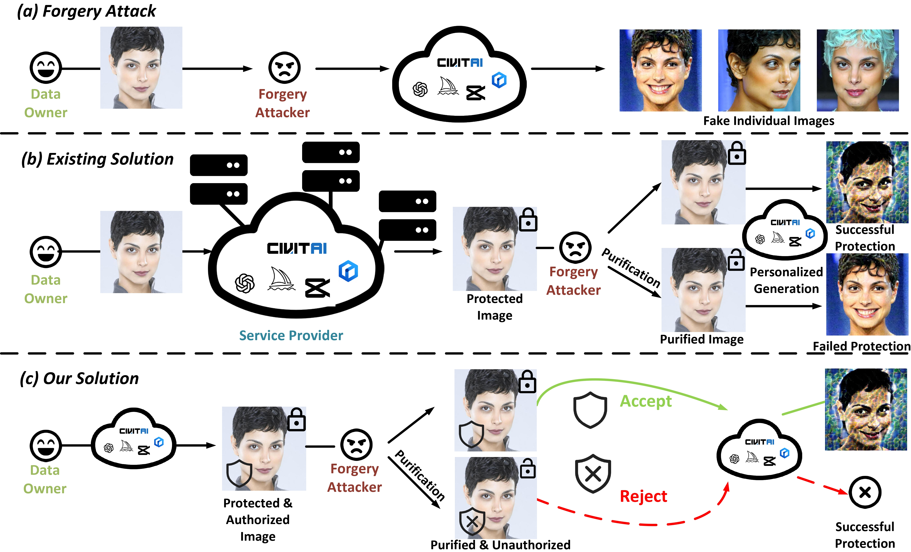

# 🛡️ Anti-Tamper Protection for Unauthorized Individual Image Generation 

**Official Code for ICCV 2025 Paper**  
📄 **[Anti-Tamper Protection for Unauthorized Individual Image Generation](https://arxiv.org/abs/2508.06325)**  


<div style="text-align;">
    
</div>


## <a name="installation"></a>⚙️ Environment Setup

```shell
conda create --name ATP --file requirements.txt
conda activate ATP
```


## <a name="installation"></a>🔐 Launch ATP 

1. Download Dataset CelebA-HQ and VGGFace2. The links for datasets can be found from [CelebA-HQ](https://drive.google.com/drive/folders/1JX4IM6VMkkv4rER99atS4x4VGnoRNByV), [VGGFace2](https://drive.google.com/drive/folders/1JX4IM6VMkkv4rER99atS4x4VGnoRNByV). For authorization model trainng, [FFHQ](https://github.com/NVlabs/ffhq-dataset) should also be downloaded

2. Download [authorization model weights](https://github.com/Seeyn/Anti-Tamper-Perturbation/releases/download/v1/random_050_block16_wreg--epoch-65000.pyt) and the guiding [mask](https://github.com/Seeyn/Anti-Tamper-Perturbation/releases/download/v1/050_mask.pt)

3. Set `weights` path in configs/authorization.yaml and `mask` path in configs/protection.yaml

4. Run

```shell
python perturb.py --device cuda:0 --input_dir path_to_cleanData --output_dir path_to_perturbedData --method CAAT --input-mask path_to_mask
```

| Argument       | Description                            | Example                      |
| -------------- | -------------------------------------- | ---------------------------- |
| `--device`     | Decide to run the model on which gpu            | `cuda:0`, `cuda:1`              |
| `--input_dir`  | Path to the clean input images         | `./data/clean/`              |
| `--output_dir` | Path to save the perturbed images      | `./data/perturbed/`          |
| `--method`     | Protection perturbation method         | `CAAT`, `ANTIDB`, `ADVDM`,`METACLOAK` |
| `--input-mask`     | Path to the mask | `./mask/050_mask.pt` |

We recommend integrate CAAT with ATP which achieves good balance in generation efficiency and protection performance. But we also supply code for integrating  MetaCloak, Anti-DreamBooth and AdvDM.


### 📁 Output Directory Structure

```
output_dir/
├── Authorized/  # Authorized images
├        ├ {id}/ # Authorized images separated by id
├        ├ Authorization_messages/ # Authorization messages for each image
└── ATP_{method}/     # Protected Images by ATP+{method}
         ├ {id}/ # ATP Perturbed images separated by id
```

## <a name="installation"></a>🔍 Verification

1. Set `weights` path in configs/verification.yaml

2. ✅ Without Purification: Run


```shell
cd authorization
python verify.py --message_dir path_to_authorization_messages  --input_dir path_to_atp_protected_image --method CAAT
```
3. 🔓 Under Purification 

- Naive Transformation: Run

```shell
cd authorization
python verify.py --message_dir path_to_authorization_messages  --input_dir path_to_atp_protected_image --method CAAT --noise-args 2 --noise-type Resize
```
```shell
cd authorization
python verify.py --message_dir path_to_authorization_messages  --input_dir path_to_atp_protected_image --method CAAT --noise-args 70 --noise-type JPEG
```

- Advanced Purification: GridPure

1. First run the [GridPure](https://github.com/zhengyuezhao/gridpure)
2. Run

```shell
cd authorization
python verify.py --message_dir path_to_authorization_messages  --input_dir path_to_atp_protected_image --method GridPure
```


| Argument       | Description                            | Example                      |
| -------------- | -------------------------------------- | ---------------------------- |
| `--message_dir_dir`  | Path to the authorization messages dir        | `./data/Authorization_messages`              |
| `--input_dir` | Path to the images for verification    | `./data/perturbed/`          |
| `--method`     | Protection perturbation method         | `CAAT`, `ANTIDB`, `ADVDM`,`METACLOAK` |
| `--noise-args`     | Protection perturbation method         | `2`, `50` |
| `--noise-type`     | Protection perturbation method         | `JPEG`, `Resize` |

Example Output：
```shell
Average Bit-Error: 0.44984375 Unauthorized image Ratio: 1.0 Pass Verification Identity Num: 0
```

"Pass Verification Identity Num" can be used to calculate Protect Success Rate (PSR). Once the purification happen and the ideneity can't pass the verification. We regard it as a successful protection.
## <a name="installation"></a>🧑‍🎨 Generation

If the images pass the verification, they can be used for generation.


1. ✅ Without Purification: Run

```shell
 cd generation
 python generate.py --input_dir path_to_image_for_generation --method CAAT --device cuda:0
```

The results are saved in "DREAMBOOTH" directory.

2. 🔓 Under Purification 

Although the purified images are not utilized for generation in our experiments due to their complete failure in passing verification, we still include code for baseline algorithms to enable comparison.

For JPEG and Resize, Run:
```shell
 cd generation
 python generate.py --input_dir path_to_image_for_generation --method CAAT --device cuda:0 --purification naive
```
For Gridpure, you need to first run the [GridPure](https://github.com/zhengyuezhao/gridpure), then use the purified images to run:
```shell
 cd generation
 python generate.py --input_dir path_to_image_for_generation --method CAAT --device cuda:0 --purification gridpure
```


 

 ## <a name="installation"></a>🧾 Metrics Calculation


1. Download ID embedding from [celebahq](https://github.com/Seeyn/Anti-Tamper-Perturbation/releases/download/v1/celeba_avg_id), [vggface](https://github.com/Seeyn/Anti-Tamper-Perturbation/releases/download/v1/vggface_avg_id).  

2. Modify the settings defined on ./configs/metrics.yaml. You need to define the path to the image to be evaluated （instance_dir） and the path to directory for storing **evaluation result record file** （output_dir）, the prompt used to do generation, ID embedding path（id_emb_path）. 

3. Download [LIQE.pt](https://drive.google.com/file/d/1GoKwUKNR-rvX11QbKRN8MuBZw2hXKHGh/view) from [url](https://github.com/zwx8981/LIQE). Place it to ./metrics/LIQE/checkpoints

```shell
 cd metrics
 python eval_dir.py --dataset CelebA-HQ --method CAAT
```
| Argument       | Description                            | Example                      |
| -------------- | -------------------------------------- | ---------------------------- |
| `--dataset`  | Dataset for evaluation       | `CelebA-HQ`, `VGGFace2`             |
| `--method`     | Protection perturbation method         | `CAAT`, `ANTIDB`, `ADVDM`,`METACLOAK` |

The evaluation result will be saved in the output_dir you define in the metrics.yaml
```shell
 python show.py --path evaluation_results
```
Example Output：
```shell
CLIP-IQAC       LIQE            ISM             FDFR             PSR
-0.176525       1.033371        0.489084        0.406250        0.859375
```
(By modifying the eval_dir.py code in line 67 to line 68 (commented), you can also evaluate the purified generation result from naive transformation.)


## 📈 Training

You can also train your own authorization model.

Modify the settings in ./configs/authorization.yaml

```
cd authorization

bash scripts/train.sh 
```

## 📚 Acknowledgement

To construct this project, we borrowed codes from: [LIQE](https://github.com/zwx8981/LIQE), [GridPure](https://github.com/zhengyuezhao/gridpure), [ANTIDB](https://github.com/VinAIResearch/Anti-DreamBooth), [METACLOAK](https://github.com/liuyixin-louis/MetaCloak), [CAAT](https://github.com/CO2-cityao/CAAT/tree/main), [HiDDeN](https://github.com/ando-khachatryan/HiDDeN), [BasicSR](https://github.com/XPixelGroup/BasicSR).

Thanks for their excellent work!
> 📌 *If you find this project useful in your research, please consider citing our paper.*
